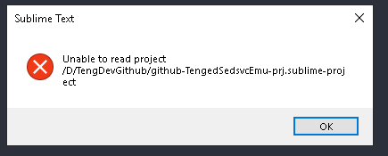

# Sublime

## При странностях отображения или редактирования markDown

примеры:

- ошибочное сообщение о непарных скобках
- не срабатывает превью по ctrl+shift+m (через меню работает)

что делать:

- проверить параметры табуляции внизу справа (пробелы, размер 4)
- проверить правильность языка (markDown)

## просмотр установленных пакетов

```text
Preferences -> Package Control -> List Packages
```

## поиск парных скобок в тексте

втать на открывающую (закрывающую) скобку и нажать ctrl-m. проверено
для круглых и квадратных

## MarkdownEditing

[MarkdownEditing https://sublimetext-markdown.github.io/MarkdownEditing](https://sublimetext-markdown.github.io/MarkdownEditing)

## Орфография русского языка

Примечание: после перезапуска редактора - не включается автоматически. Нужно
нажать F6. Признак того, что включено - английские теги подчеркнуты красным

меню “View” - “Dictionary” под пунктом “Language - English”
появиться пункт “russian-english”

Чтобы осуществить проверку (spellcheck) на ошибки в русско-язычном тексте в
редакторе Sublime Text, нужно выбрать в меню вышеназванный пункт -
“View” - “Dictionary” - “russian-english”, тем самым указав редактору,
какой - словарь использовать для проверки. А затем запустить
проверку орфографии (spellcheck), нажав клавишу F6. Повторное нажатие клавиши
отключает проверку орфографии.

## добавление/удаление слов для игнорирования проверки орфографии

игнорирование слов: C:\Users\sysop\AppData\Roaming\Sublime
Text\Packages\User\Preferences.sublime-settings

````json
{
"word_wrap": false,
  "index_files": true,
  "dictionary": "Packages/russian_english.dic",
  "ignored_words":
  [
    "БЭМ"
  ],
}
````

## в случае ошибки sublime-project - Unable to read project

Если при открытии проекта или при запуске Sublime отображается ошибка

Unable to read project .../github-test4-prj.sublime-project



Причина - возможно повреждение структуры json внутри указанного файла.

Простое решение - удалить файл (он самовосстановится после открытия в sublime проекта)
